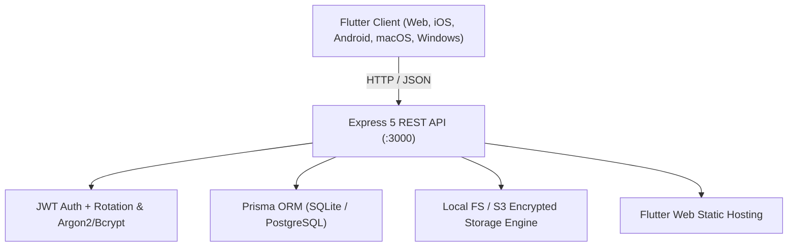

# 🚀 Spaces — Global Digital Organization & Cloud Storage Platform

> **"Store it once. Find it instantly."**
> 
> Don't search through your device storage. Create a **Space** for what matters and keep everything related to it together.

---

## 🌟 Overview

**Spaces** is a modern digital organization platform built from the ground up to replace traditional, disjointed cloud folder hierarchies with contextual, purpose-driven **Spaces** (e.g. *College*, *Work*, *Projects*, *Travel*, *Personal*, *Important Docs*).

Inside each Space, users can store, organize, search, share, favorite, and manage:
- 📄 Documents (PDFs, Office documents, text files)
- 🖼️ Photos & Media (Images, Videos, Audio)
- 📝 Notes (Rich markdown notes)
- 🔗 Web Links & Bookmarks
- 📦 Code files & Archives

The platform features an ultra-responsive **Flutter (Web, Desktop & Mobile)** client powered by an enterprise-grade **Node.js + Express 5 + Prisma** REST backend.

---

## 🏗️ Architecture & Technology Stack



### 1. Frontend (`spaces_app/`)
* **Framework**: Flutter 3.x (Multiplatform: Web, iOS, Android, macOS, Windows)
* **Architecture**: Clean Architecture with Feature-First modularity:
  * `core/`: Themes, constants, HTTP client interceptors, utilities
  * `data/`: Models, repository implementations, local cache (`shared_preferences`)
  * `domain/`: Entities and repository contracts
  * `presentation/`: Riverpod / Provider state management, responsive UI widgets
* **Aesthetics**: Premium Dark / Modern UI, fluid micro-interactions, responsive sidebars, grid/list view toggles, color-coded Spaces, and contextual bottom sheets.

### 2. Backend (`backend/`)
* **Runtime & Language**: Node.js v20+, TypeScript, Express 5
* **Database & ORM**: Prisma ORM with SQLite (zero-config local dev) and instant switch to PostgreSQL for production
* **Security & Hardening**:
  * Helmet security headers & CORS policy
  * Express rate limiting
  * JWT access tokens with rotating refresh tokens and JTI UUID replay defense
  * Bcrypt password hashing
  * Parameter sanitization and strict Zod validation schemas
* **Storage Engine**: Pluggable storage abstraction supporting local sandboxed file storage and AWS S3 / MinIO.

---

## 🔑 Pre-Seeded Demo Credentials

The database is pre-seeded with rich sample spaces (*College*, *Personal Work*, *Projects*, *Travel 2026*, *Important Docs*) and diverse file types:

| Role | Email | Password |
|---|---|---|
| **Demo User** | `demo@spaces.app` | `Password123!` |

---

## 🚦 Quick Start Guide

### Prerequisites
- **Node.js**: v18+ (v20+ recommended)
- **npm** or **pnpm**
- **Flutter SDK**: 3.22+ (for running/building native Flutter apps)

---

### 1. Start the Backend API (Dev Mode)

```bash
cd backend
npm install
npx prisma generate
npx prisma db push
npm run db:seed
npm run dev
```

The backend server starts on **`http://localhost:3000`**.

> **Note**: The backend automatically serves the production Flutter Web build from `spaces_app/build/web`. Opening `http://localhost:3000` in any web browser loads the complete Spaces web application!

### Deep Search + AI Service

The OpenAI integration runs as a separate FastAPI service. The Express API remains the client-facing backend and proxies authenticated requests to it.

1. For this existing local SQLite database, apply the additive schema with `cd backend && npx prisma db push && npx prisma generate`. The SQL migration is included for migration-managed environments; because this repository previously used `db push` and has no baseline migration history, production databases must be baselined before running `prisma migrate deploy`.
2. Install the AI service dependencies: `cd ai_service && python -m pip install -r requirements.txt`.
3. Copy `ai_service/.env.example` to `ai_service/.env`, then set `OPENAI_API_KEY` and a long random `AI_SERVICE_TOKEN`. Put the same token and `AI_SERVICE_URL=http://127.0.0.1:8000` in `backend/.env`. Keep both `.env` files local.
4. Start FastAPI from `ai_service`: `uvicorn main:app --env-file .env --reload --host 127.0.0.1 --port 8000`.
5. Start Express from `backend`: `npm run dev`.
6. Existing Notes and supported files can be queued from the Assistant's **Index existing documents** control. New Notes and supported uploads are indexed in the background. Indexable files show status and retry controls in file lists.

The authenticated Flutter Assistant uses `POST /api/v1/ai/deep-search`. Express restricts retrieval to non-deleted, non-trashed files in Spaces the user owns or can access before sending excerpts to FastAPI. The current vector store is SQLite/Prisma with serialized embeddings and bounded in-process cosine/hybrid scoring; it does not require PostgreSQL or another database.

Initial ingestion supports Notes, text, Markdown, and text-based PDFs with page numbers. Scanned PDFs are marked `OCR_REQUIRED`; OCR is not implemented. DOCX, PPTX, XLSX, and image OCR are not yet supported. PDF viewing on Web uses pdf.js from its configured CDN; it requires network access. Keep the AI service bound to localhost or a private network. Never put `OPENAI_API_KEY` in Flutter or the Express environment.

Keep the AI service bound to localhost or a private network. Never put `OPENAI_API_KEY` in the Flutter app or the Express backend environment.

---

### 2. Run the Flutter Client Locally

#### Web:
```bash
cd spaces_app
flutter run -d chrome
```

#### Windows Desktop:
```bash
cd spaces_app
flutter run -d windows
```

#### Rebuilding the Web Bundle:
```bash
cd spaces_app
flutter build web --release
```

---

## 🧪 Automated Testing

Spaces includes a comprehensive end-to-end API test suite validating all platform capabilities:

```bash
cd backend
node test_e2e.js
```

### Test Suite Coverage:
1. `GET /health` — Service health & version verification
2. `POST /api/v1/auth/login` — Authentication with demo credentials
3. `POST /api/v1/auth/refresh` — Token rotation & token revocation
4. `GET /api/v1/spaces` — Multi-space listing & count validation
5. `POST /api/v1/spaces` — Creating a new Space (*AI & Systems Research*)
6. `POST /api/v1/files/notes-links` — Creating Markdown Notes
7. `POST /api/v1/files/notes-links` — Creating Web Links/Bookmarks
8. `GET /api/v1/search?q=...` — Cross-space universal search
9. `POST /api/v1/files/:id/favorite` — Star / Favorite toggle
10. `GET /api/v1/favorites` — Favorites listing
11. `POST /api/v1/files/:id/trash` — Moving files to Trash
12. `GET /api/v1/trash` — Trashed items view
13. `POST /api/v1/files/:id/restore` — Restoring from Trash
14. `POST /api/v1/share` — Generating secure share tokens
15. `POST /api/v1/share/resolve/:token` — Public unauthenticated link resolution
16. `GET /api/v1/storage` — Storage quota and category usage breakdown

---

## 📁 Repository Structure

```
my_space/
├── backend/
│   ├── prisma/
│   │   ├── schema.prisma       # Prisma models (User, Space, File, ShareLink, etc.)
│   │   └── seed.ts             # Rich initial data seeding script
│   ├── src/
│   │   ├── config/             # Environment, Database, & Storage configs
│   │   ├── middleware/         # Auth, Error Handling, Validation, Logging
│   │   ├── modules/
│   │   │   ├── auth/           # Login, Register, Refresh, Profile
│   │   │   ├── spaces/         # Spaces CRUD, stats, color/icon tags
│   │   │   ├── files/          # Upload, Download, Notes, Links, Versions
│   │   │   ├── sharing/        # Public links, passwords, expiration
│   │   │   └── discovery/      # Search, Recent, Favorites, Trash, Storage
│   │   ├── utils/              # Filename sanitization, token generator, errors
│   │   ├── app.ts              # Express application assembly & static serving
│   │   └── server.ts           # HTTP server listener
│   ├── test_e2e.js             # 15-step end-to-end integration test suite
│   └── package.json
└── spaces_app/
    ├── lib/
    │   ├── core/               # Theme, constants, networking, routing
    │   ├── data/               # Models and repositories
    │   └── presentation/       # Riverpod providers, screens, and widgets
    │       ├── screens/        # Auth, Spaces, Files, Search, Favorites, Trash
    │       └── widgets/        # Space cards, file tiles, upload sheets
    ├── web/                    # Flutter web shell & manifest
    └── pubspec.yaml
```

---

## 🔒 Security Best Practices Implemented

1. **Replay Protection**: Refresh tokens are single-use and rotated on every exchange with individual `jti` cryptographic tokens.
2. **Access Control**: Public share resolution is scoped independently so protected endpoints always require Bearer tokens.
3. **Path Traversal Protection**: All uploaded and created filenames undergo strict regex sanitization.
4. **Zero-Trust Share Links**: Optional password protection and time-based expiration (`expiresAt`) on shared files and spaces.
5. **Soft Delete & Recovery**: Trashing items preserves the original storage while allowing clean restoration or permanent purging.
